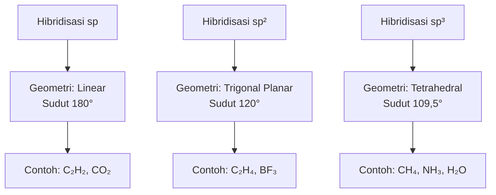
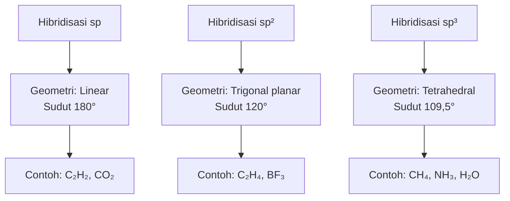

# 📘 Ringkasan Hibridisasi dalam Kimia

## Apa itu Hibridisasi?
Hibridisasi adalah proses pencampuran **orbital atomik** (s, p, kadang d) pada **satu atom pusat** 
untuk membentuk orbital baru (**orbital hibrida**) yang setara energi dan memiliki orientasi tertentu.  
Konsep ini dipakai untuk menjelaskan **bentuk geometri molekul kovalen**.

---

## Jenis-jenis Hibridisasi Umum

| Jenis Hibridisasi | Orbital yang Dicampur | Jumlah Orbital Hibrida | Geometri | Sudut Ikatan | Contoh Molekul |
|-------------------|------------------------|-------------------------|-----------|--------------|----------------|
| **sp**           | 1 s + 1 p             | 2                      | Linear    | 180°         | C₂H₂ (asetilena), CO₂ |
| **sp²**          | 1 s + 2 p             | 3                      | Trigonal planar | 120° | C₂H₄ (etena), BF₃ |
| **sp³**          | 1 s + 3 p             | 4                      | Tetrahedral | 109,5° | CH₄ (metana), NH₃, H₂O |

---

## Hubungan dengan Bilangan Kuantum
- Orbital **p** berasal dari ℓ = 1, dengan mℓ = −1, 0, +1 (px, py, pz).
- Orbital **s** berasal dari ℓ = 0, mℓ = 0.
- Dalam **sp³**, 1 orbital s (mℓ=0) bercampur dengan 3 orbital p (mℓ = −1, 0, +1).
- Orbital hibrida yang dihasilkan **tidak lagi punya mℓ asli**, melainkan kombinasi linier.

---

## Apakah Hibridisasi Selalu Terjadi?

| Jenis Ikatan / Interaksi | Apakah Hibridisasi Terjadi? | Penjelasan |
|---------------------------|------------------------------|------------|
| **Ikatan kovalen (σ bond)** | ✅ Ya | Elektron dibagi → overlap orbital → hibridisasi menjelaskan bentuk ikatan. |
| **Ikatan kovalen (π bond)** | ➖ Tidak langsung | π bond berasal dari orbital p murni (tidak dihibridisasi). |
| **Ikatan ionik** | ❌ Tidak | Terjadi karena gaya elektrostatik, tidak butuh hibridisasi. |
| **Ikatan logam** | ❌ Tidak | Elektron terdelokalisasi (model lautan elektron). |
| **Ikatan hidrogen / van der Waals** | ❌ Tidak | Interaksi antar molekul, tidak dijelaskan dengan hibridisasi. |

---

## Bagan Alur Hibridisasi → Geometri → Contoh

## Kesimpulan

- Hibridisasi hanya relevan untuk **ikatan kovalen** (terutama σ bond).
    
- Geometri molekul dapat diprediksi dari jenis hibridisasi:
    
    - sp → linear
        
    - sp² → trigonal planar
        
    - sp³ → tetrahedral

