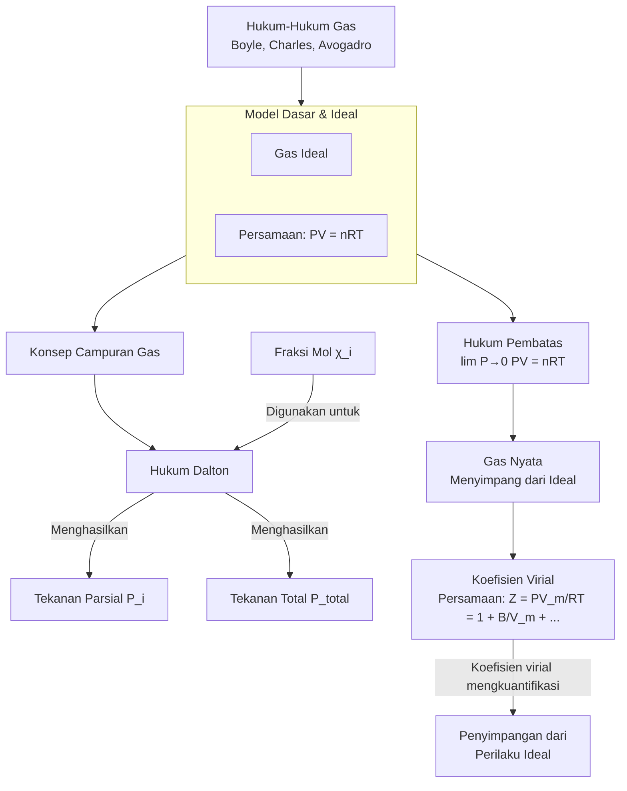

Tentu. Sebagai seorang ahli kimia fisik, saya dengan senang hati memberikan penjelasan komprehensif mengenai konsep-konsep fundamental teori gas. Penjelasan ini akan disusun secara sistematis, dari model yang paling sederhana hingga yang paling kompleks, menunjukkan evolusi pemikiran kita dalam memahami perilaku gas.

### **Pendahuluan: Dari Ideal ke Nyata**

Pemahaman kita tentang gas dimulai dengan model yang sangat disederhanakan—**Gas Ideal**—yang memungkinkan kita untuk menurunkan hubungan matematika yang elegan (**Hukum-Hukum Gas**). Namun, dalam aplikasi dunia nyata, gas menyimpang dari perilaku ideal ini, yang mengarahkan kita pada konsep **Gas Nyata** dan alat koreksi seperti **Koefisien Virial**. Konsep-konsep lain seperti **Fraksi Mol**, **Tekanan Parsial**, dan **Tekanan Total** adalah alat untuk menggambarkan campuran gas, sementara **Hukum Pembatas** menjadi jembatan antara dunia ideal dan nyata.

---

### **1. Gas Ideal (Ideal Gas)**

**Definisi:** Gas Ideal adalah model teoretis gas yang mematuhi persamaan keadaan gas ideal secara sempurna di semua kondisi suhu dan tekanan. Model ini didasarkan pada dua asumsi utama:
1.  **Volume molekul gas diabaikan** (dianggap sebagai titik massa).
2.  **Tidak ada gaya tarik-menarik atau tolak-menolak** antar molekul gas. Satu-satunya interaksi adalah tumbukan elastis sempurna dengan dinding wadah dan antar molekul.

**Persamaan Matematika:**
Persamaan keadaan gas ideal dinyatakan sebagai:
$$PV = nRT$$
*   **P** = Tekanan (Pa atau atm)
*   **V** = Volume (m³ atau L)
*   **n** = Jumlah mol gas (mol)
*   **R** = Konstanta gas universal (8.314 J/mol·K atau 0.0821 L·atm/mol·K)
*   **T** = Suhu absolut (Kelvin, K)

**Asumsi & Batasan:**
Asumsi di atas hanya berlaku secara *aproksimasi* pada kondisi **tekanan sangat rendah dan suhu sangat tinggi**. Pada tekanan tinggi atau suhu rendah, penyimpangan menjadi signifikan karena volume molekul dan gaya antarmolekul tidak dapat lagi diabaikan.

**Aplikasi Praktis:**
Meskipun merupakan penyederhanaan, model ini sangat berguna untuk perhitungan cepat dan estimasi dalam berbagai skenario, seperti:
*   Menghitung volume gas yang dihasilkan dalam suatu reaksi kimia.
*   Mendesain sistem pneumatik tekanan rendah.
*   Mengkalibrasi alat ukur tekanan.

---

### **2. Hukum-Hukum Gas (Gas Laws)**

**Definisi:** Hukum-hukum gas adalah hubungan empiris yang mendahului dan menjadi fondasi bagi persamaan gas ideal. Masing-masing hukum mengamati hubungan antara dua variabel keadaan gas dengan menjaga variabel lainnya konstan.

**Persamaan Matematika:**
1.  **Hukum Boyle (1662):** `P ∝ 1/V` (pada T dan n konstan) → `P₁V₁ = P₂V₂`
2.  **Hukum Charles (1787):** `V ∝ T` (pada P dan n konstan) → `V₁/T₁ = V₂/T₂`
3.  **Hukum Avogadro (1811):** `V ∝ n` (pada P dan T konstan) → `V₁/n₁ = V₂/n₂`

Kombinasi dari ketiga hukum ini menghasilkan **Hukum Gas Gabungan (Combined Gas Law)** `(P₁V₁)/T₁ = (P₂V₂)/T₂`, yang pada akhirnya mengarah pada penurunan persamaan gas ideal `PV = nRT`.

**Hubungan dengan Gas Ideal:** Hukum-hukum gas adalah kasus khusus dari persamaan gas ideal. Mereka adalah batu bata penyusun yang membentuk model gas ideal yang lebih umum.

---

### **3. Gas Sempurna (Perfect Gas)**

**Definisi:** Dalam konteks termodinamika, istilah **Gas Sempurna** sering digunakan secara bergantian dengan **Gas Ideal**. Namun, terdapat nuansa subtle:
*   **Gas Ideal** secara ketat mengacu pada gas yang mematuhi persamaan `PV = nRT`.
*   **Gas Sempurna** kadang-kadang digunakan untuk menekankan bahwa gas tersebut juga memiliki **energi dalam (U)** yang hanya bergantung pada suhu (`U = U(T)`), dan bukan pada volume atau tekanan.

**Kesimpulan:** Untuk sebagian besar tujuan kimia fisik, kedua istilah ini dianggap sinonim. `PV = nRT` menyiratkan bahwa `U` hanya bergantung pada `T`.

---

### **4. Fraksi Mol (Mole Fraction)**

**Definisi:** Fraksi mol (`χ_i`) adalah satuan konsentrasi yang didefinisikan sebagai perbandingan jumlah mol suatu komponen dalam campuran terhadap jumlah total mol semua komponen dalam campuran tersebut.

**Persamaan Matematika:**
Untuk suatu komponen `i` dalam campuran:
$$\chi_i = \frac{n_i}{n_{total}}$$
*   **n_i** = Jumlah mol komponen `i`
*   **n_total** = Total mol semua komponen dalam campuran (`n₁ + n₂ + ...`)

**Sifat Penting:** Jumlah fraksi mol semua komponen selalu sama dengan 1:
$$\sum \chi_i = \chi_1 + \chi_2 + ... = 1$$

---

### **5. Tekanan Parsial (Partial Pressure) & Hukum Dalton**

**Definisi:** Tekanan parsial suatu komponen gas dalam campuran adalah tekanan yang akan diberikan oleh komponen gas tersebut jika ia sendiri menempati volume keseluruhan wadah pada suhu yang sama.

**Persamaan Matematika (Hukum Dalton):**
Tekanan parsial (`P_i`) suatu komponen berbanding lurus dengan fraksi molnya (`χ_i`):
$$P_i = \chi_i \cdot P_{total}$$
*   **P_i** = Tekanan parsial komponen `i`
*   **P_total** = Tekanan total campuran gas

**Hukum Dalton tentang Tekanan Parsial (1801):** **Tekanan total (`P_total`) suatu campuran gas ideal adalah jumlah dari tekanan parsial semua komponen gas dalam campuran tersebut.**
$$P_{total} = P_1 + P_2 + P_3 + ... = \sum P_i$$

**Aplikasi Praktis:**
*   **Pernapasan:** Pertukaran oksigen (O₂) dan karbon dioksida (CO₂) dalam alveolus paru-paru dikendalikan oleh tekanan parsialnya.
*   **Industri:** Pengaturan atmosfer gas dalam proses pengelasan (misalnya, campuran Argon dan CO₂) untuk mencegah oksidasi.
*   **Klimatikologi:** Konsentrasi gas rumah kaca di atmosfer sering dinyatakan dalam tekanan parsialnya.

---

### **6. Tekanan Total (Total Pressure)**

**Definisi:** Tekanan total adalah tekanan yang diberikan oleh seluruh campuran gas pada dinding wadahnya. Seperti telah dinyatakan dalam Hukum Dalton, untuk gas ideal, tekanan total adalah jumlah sederhana dari semua tekanan parsial.

**Hubungan:** Konsep ini tidak dapat dipisahkan dari tekanan parsial dan fraksi mol. Mengukur tekanan total adalah hal yang mudah (dengan manometer), sementara tekanan parsial sering perlu dihitung menggunakan fraksi mol.

---

### **7. Gas Nyata (Real Gas)**

**Definisi:** Gas Nyata adalah gas yang *tidak* sepenuhnya mematuhi persamaan gas ideal, terutama pada kondisi **tekanan tinggi** dan **suhu rendah**. Penyimpangan ini terjadi karena dua asumsi gas ideal menjadi tidak valid:
1.  **Volume molekul tidak dapat diabaikan** lagi dibandingkan dengan volume wadah.
2.  **Gaya antarmolekul (terutama gaya tarik London)** menjadi signifikan.

**Asumsi & Batasan:** Perilaku gas nyata adalah perilaku *sebenarnya* yang diamati di laboratorium dan industri. Model gas ideal adalah aproksimasi yang buruk untuk gas nyata pada kondisi ini.

**Contoh Penyimpangan:**
*   Pada tekanan tinggi, `PV > nRT` karena volume molekul dominan (efek tolak-menolak).
*   Pada tekanan menengah/suhu rendah, `PV < nRT` karena gaya tarik antarmolekul mengurangi tekanan yang diukur pada dinding.

---

### **8. Hukum Pembatas (Limiting Law)**

**Definisi:** Hukum Pembatas, atau dalam konteks ini sering disebut **Hukum Gas Ideal sebagai Hukum Pembatas**, menyatakan bahwa **semua gas nyata mendekati perilaku gas ideal pada limit tekanan mendekati nol**.
$$\lim_{P \to 0} (PV) = nRT$$
Atau, untuk satu mol gas (`n=1`), $\lim_{P \to 0} (PV_m) = RT$, dimana `V_m` adalah volume molar.

**Hubungan dengan Konsep Lain:** Konsep ini sangat penting karena menjadi **jembatan** antara dunia gas ideal dan gas nyata. Ini memberitahu kita bahwa persamaan gas ideal bukanlah kesalahan; itu adalah perilaku *pembatas* yang didekati oleh semua gas nyata ketika interaksi antarmolekul menjadi tidak relevan. Koefisien virial (konsep berikutnya) didefinisikan berdasarkan penyimpangan dari hukum pembatas ini.

---

### **9. Koefisien Virial (Virial Coefficients)**

**Definisi:** Koefisien Virial adalah parameter dalam **Persamaan Virial**, yang merupakan persamaan keadaan untuk gas nyata yang mengekspresikan deviasi dari perilaku ideal sebagai deret pangkat dalam tekanan (`P`) atau dalam invers volume molar (`1/V_m`).

**Persamaan Matematika:**
Bentuk yang paling umum (dalam `1/V_m`):
$$Z = \frac{PV_m}{RT} = 1 + \frac{B(T)}{V_m} + \frac{C(T)}{(V_m)^2} + \frac{D(T)}{(V_m)^3} + ...$$
*   **Z** = Faktor kompresibilitas (`Z=1` untuk gas ideal).
*   **B(T), C(T), D(T), ...** = Koefisien virial kedua, ketiga, keempat, dan seterusnya. Mereka bergantung pada suhu dan identitas gas, tetapi *tidak* pada tekanan.
*   **B(T)** adalah yang paling penting, merepresentasikan interaksi antar dua molekul (pairwise interactions).

**Interpretasi:**
*   **B(T) < 0** pada suhu rendah: Gaya tarik dominan (`Z < 1`).
*   **B(T) > 0** pada suhu tinggi: Gaya tolak/volume molekul dominan (`Z > 1`).
*   **Suhu Boyle:** Suhu dimana `B(T) = 0`, dan gas berperilaku hampir ideal untuk rentang tekanan yang luas.

**Aplikasi Praktis:** Persamaan virial digunakan untuk perhitungan presisi tinggi dalam teknik kimia dan penelitian, seperti mendesain tangki penyimpanan gas bertekanan tinggi atau mensimulasikan perilaku fluida dalam reservoir minyak dan gas.

---

### **Hubungan Logis dan Sistematis Antar Konsep**

Diagram alur berikut merangkum hubungan keseluruhan antar kesembilan konsep tersebut:

**Penjelasan Hubungan:**

1.  **Dasar Teori:** **Hukum-hukum Gas** (Boyle, Charles, Avogadro) adalah observasi empiris yang digabungkan untuk membentuk model teoretis **Gas Ideal** (`PV=nRT`) atau **Gas Sempurna**.
2.  **Menganalisis Campuran:** Untuk menganalisis campuran gas ideal, kita menggunakan **Fraksi Mol** (`χ_i`) sebagai ukuran konsentrasi. Hukum **Tekanan Parsial** Dalton (`P_i = χ_i * P_total`) kemudian menghubungkan fraksi mol dengan tekanan yang dikontribusikan oleh setiap komponen, yang jumlahnya adalah **Tekanan Total**.
3.  **Transisi ke Realitas:** Model ideal memiliki batasan. **Hukum Pembatas** memberitahu kita bahwa model ideal hanya akurat pada tekanan sangat rendah. Pada kondisi nyata (**tekanan tinggi/suhu rendah**), kita berurusan dengan **Gas Nyata**.
4.  **Koreksi atas Realitas:** Perilaku Gas Nyata yang menyimpang dari ideal ini dikuantifikasi secara matematis menggunakan **Koefisien Virial** dalam Persamaan Virial. Koefisien-koefisien ini (terutama `B(T)`) secara eksplisit mengukur seberapa besar sebuah gas nyata menyimpang dari perilaku idealnya, yang ditentukan oleh Hukum Pembatas.

Dengan demikian, pemahaman kita berkembang dari model sederhana yang powerful (Ideal) menuju model yang lebih kompleks dan akurat (Virial) untuk menjawab tantangan dalam aplikasi dunia nyata, dengan Hukum Pembatas sebagai penghubung fundamental di antara keduanya.