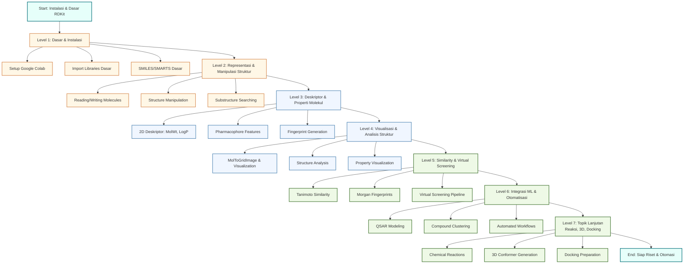
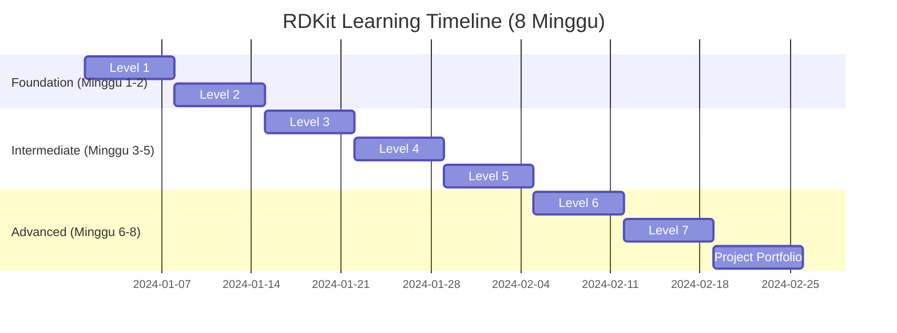
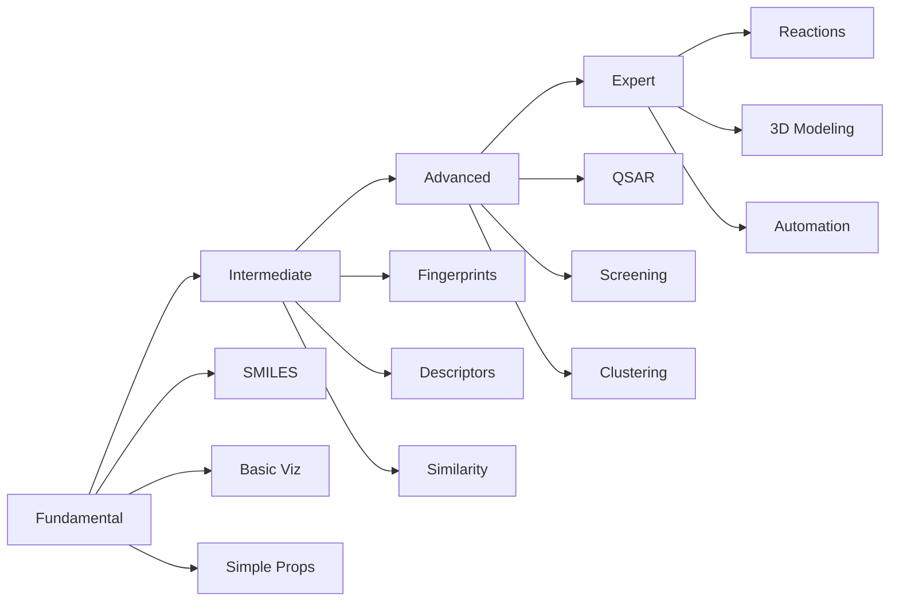

# Roadmap

```mermaid
flowchart TD
    Start[Start: Instalasi & Dasar RDKit] --> L1[Level 1: Dasar & Instalasi]
    
    L1 --> L1A[Setup Google Colab]
    L1 --> L1B[Import Libraries Dasar]
    L1 --> L1C[SMILES/SMARTS Dasar]
    
    L1 --> L2[Level 2: Representasi & Manipulasi Struktur]
    
    L2 --> L2A[Reading/Writing Molecules]
    L2 --> L2B[Structure Manipulation]
    L2 --> L2C[Substructure Searching]
    
    L2 --> L3[Level 3: Deskriptor & Properti Molekul]
    
    L3 --> L3A[2D Deskriptor: MolWt, LogP]
    L3 --> L3B[Pharmacophore Features]
    L3 --> L3C[Fingerprint Generation]
    
    L3 --> L4[Level 4: Visualisasi & Analisis Struktur]
    
    L4 --> L4A[MolToGridImage & Visualization]
    L4 --> L4B[Structure Analysis]
    L4 --> L4C[Property Visualization]
    
    L4 --> L5[Level 5: Similarity & Virtual Screening]
    
    L5 --> L5A[Tanimoto Similarity]
    L5 --> L5B[Morgan Fingerprints]
    L5 --> L5C[Virtual Screening Pipeline]
    
    L5 --> L6[Level 6: Integrasi ML & Otomatisasi]
    
    L6 --> L6A[QSAR Modeling]
    L6 --> L6B[Compound Clustering]
    L6 --> L6C[Automated Workflows]
    
    L6 --> L7[Level 7: Topik Lanjutan<br/>Reaksi, 3D, Docking]
    
    L7 --> L7A[Chemical Reactions]
    L7 --> L7B[3D Conformer Generation]
    L7 --> L7C[Docking Preparation]
    
    L7 --> End[End: Siap Riset & Otomasi]

    %% Styling dengan format yang benar
    classDef startEnd fill:#e6fffa,stroke:#006d77,stroke-width:2px
    classDef basic fill:#fff7e6,stroke:#d99058,stroke-width:2px
    classDef mid fill:#f0f6ff,stroke:#5b8db8,stroke-width:2px
    classDef advanced fill:#eef9e6,stroke:#4a7a3a,stroke-width:2px

    class Start,End startEnd
    class L1,L1A,L1B,L1C basic
    class L2,L2A,L2B,L2C basic
    class L3,L3A,L3B,L3C mid
    class L4,L4A,L4B,L4C mid
    class L5,L5A,L5B,L5C advanced
    class L6,L6A,L6B,L6C advanced
    class L7,L7A,L7B,L7C advanced
```

---

# Timeline

```mermaid
gantt
    title RDKit Learning Timeline (8 Minggu)
    dateFormat  YYYY-MM-DD
    section Foundation (Minggu 1-2)
    Level 1: Dasar & Instalasi     :2024-01-01, 7d
    Level 2: Manipulasi Struktur   :2024-01-08, 7d
    
    section Intermediate (Minggu 3-5)
    Level 3: Deskriptor Molekul    :2024-01-15, 7d
    Level 4: Visualisasi           :2024-01-22, 7d
    Level 5: Virtual Screening     :2024-01-29, 7d
    
    section Advanced (Minggu 6-8)
    Level 6: ML Integration        :2024-02-05, 7d
    Level 7: Topik Lanjutan        :2024-02-12, 7d
    Project Portfolio              :2024-02-19, 7d
```

---

# Flow

```mermaid

flowchart LR
    A[Fundamental] --> B[Intermediate] --> C[Advanced] --> D[Expert]
    
    A --> A1[SMILES]
    A --> A2[Basic Viz]
    A --> A3[Simple Props]
    
    B --> B1[Fingerprints]
    B --> B2[Descriptors]
    B --> B3[Similarity]
    
    C --> C1[QSAR]
    C --> C2[Screening]
    C --> C3[Clustering]
    
    D --> D1[Reactions]
    D --> D2[3D Modeling]
    D --> D3[Automation]
    
    class A,A1,A2,A3 basic
    class B,B1,B2,B3 mid
    class C,C1,C2,C3 advanced
    class D,D1,D2,D3 advanced
```
