[Menuju Ke File Eksekusi](https://colab.research.google.com/drive/1aBnVnHqgBDz8r6_IMXm9t-UD_y6D7PLs?usp=sharing)

```mermaid
flowchart TD
    A[🧪 Panduan RDKit] --> B[📘 Manipulasi Molekul]
    A --> C[⚗️ Menambah Cabang]
    A --> D[🧬 Informasi Molekul]
    A --> E[🧾 Laporan Lengkap]
    A --> F[🧠 Visualisasi 3D]
    
    B --> B1[Chem.RWMol]
    B --> B2[AddAtom/AddBond]
    B --> B3[Edit struktur]
    
    C --> C1[Target atom tertentu]
    C --> C2[Fungsi add_atom_branch]
    C --> C3[Custom bond type]
    
    D --> D1[🔹 Info Atom]
    D --> D2[🔹 Info Ikatan]
    D --> D3[🔹 Properti Molekul]
    
    E --> E1[molecule_report]
    E --> E2[💾 save_molecule_report]
    E --> E3[Output ke file]
    
    F --> F1[py3Dmol]
    F --> F2[Struktur 3D interaktif]
    F --> F3[Optimasi geometri]
    
    style A fill:#e1f5fe
    style B fill:#f3e5f5
    style C fill:#e8f5e8
    style D fill:#fff3e0
    style E fill:#e0f2f1
    style F fill:#fce4ec
```




# 🧪 Panduan Lengkap Manipulasi & Visualisasi Molekul dengan RDKit

## 📘 1. Membuat & Mengedit Molekul

Contoh menambah atom baru ke molekul:

```python
from rdkit import Chem
from rdkit.Chem import Draw

mol = Chem.RWMol(Chem.MolFromSmiles('CC(=O)O'))

# Tambah dua atom karbon baru
c1 = mol.AddAtom(Chem.Atom('C'))
c2 = mol.AddAtom(Chem.Atom('C'))

# Hubungkan keduanya
mol.AddBond(c1, c2, Chem.BondType.SINGLE)

# Konversi ke Mol biasa dan tampilkan
mol = mol.GetMol()
Draw.MolToImage(mol).show()
```

---

## ⚗️ 2. Menambah Cabang ke Atom Tertentu

Menambahkan satu atom baru (misalnya karbon) ke atom tertentu dalam molekul:

```python
from rdkit import Chem
from rdkit.Chem import Draw

mol = Chem.RWMol(Chem.MolFromSmiles('CC(=O)O'))
target_idx = 0  # atom karbon pertama
new_c = mol.AddAtom(Chem.Atom('C'))
mol.AddBond(target_idx, new_c, Chem.BondType.SINGLE)
mol = mol.GetMol()
Draw.MolToImage(mol).show()
```

### 🔧 Versi Fungsi Umum

```python
def add_atom_branch(mol, target_idx, new_atom_symbol='C', bond_type=Chem.BondType.SINGLE):
    rw_mol = Chem.RWMol(mol)
    new_idx = rw_mol.AddAtom(Chem.Atom(new_atom_symbol))
    rw_mol.AddBond(target_idx, new_idx, bond_type)
    return rw_mol.GetMol()

mol = Chem.MolFromSmiles('CC(=O)O')
mol_new = add_atom_branch(mol, 0, 'C')
Draw.MolToImage(mol_new).show()
```

---

## 🧬 3. Mendapatkan Informasi Molekul

### 🔹 Informasi Atom

```python
for atom in mol.GetAtoms():
    print(f"Idx: {atom.GetIdx()}, Symbol: {atom.GetSymbol()}, Valence: {atom.GetTotalValence()}")
```

### 🔹 Informasi Ikatan

```python
for bond in mol.GetBonds():
    print(f"{bond.GetBeginAtomIdx()} - {bond.GetEndAtomIdx()} | {bond.GetBondType()}")
```

### 🔹 Properti Umum Molekul

```python
from rdkit.Chem import Descriptors

print("Formula:", Chem.rdMolDescriptors.CalcMolFormula(mol))
print("Berat molekul:", Descriptors.MolWt(mol))
print("LogP:", Descriptors.MolLogP(mol))
```

---

## 🧾 4. Fungsi Laporan Molekul Lengkap

```python
from rdkit import Chem
from rdkit.Chem import Descriptors

def molecule_report(smiles: str):
    mol = Chem.MolFromSmiles(smiles)
    if mol is None:
        print("❌ SMILES tidak valid!")
        return

    print("=" * 50)
    print(f"🧪 Molekul dari SMILES: {smiles}")
    print("=" * 50)
    
    print("\n📋 INFORMASI UMUM")
    print("-" * 50)
    print(f"Rumus molekul   : {Chem.rdMolDescriptors.CalcMolFormula(mol)}")
    print(f"Berat molekul   : {Descriptors.MolWt(mol):.3f}")
    print(f"LogP            : {Descriptors.MolLogP(mol):.3f}")
    print(f"Jumlah atom     : {mol.GetNumAtoms()}")
    print(f"Jumlah ikatan   : {mol.GetNumBonds()}")
    print(f"Rotatable bonds : {Descriptors.NumRotatableBonds(mol)}")

    print("\n⚛️  DAFTAR ATOM")
    print("-" * 50)
    for atom in mol.GetAtoms():
        print(f"Idx {atom.GetIdx():<2} | {atom.GetSymbol():<2} | "
              f"Valensi: {atom.GetTotalValence():<2} | "
              f"Derajat: {atom.GetDegree():<2} | "
              f"Muatan: {atom.GetFormalCharge():<2} | "
              f"Hybridisasi: {atom.GetHybridization()}")

    print("\n🔗 DAFTAR IKATAN")
    print("-" * 50)
    for bond in mol.GetBonds():
        print(f"{bond.GetBeginAtomIdx():<2} - {bond.GetEndAtomIdx():<2} | "
              f"Tipe: {bond.GetBondType()}")

    print("\n✅ Selesai.")
    print("=" * 50)
    return mol
```

---

## 💾 4.1. Menyimpan Laporan ke File

```python
def save_molecule_report(smiles: str, filename: str):
    import sys
    from io import StringIO
    
    mol = Chem.MolFromSmiles(smiles)
    if mol is None:
        print("❌ SMILES tidak valid!")
        return

    # Redirect output ke StringIO
    old_stdout = sys.stdout
    captured_output = StringIO()
    sys.stdout = captured_output
    
    # Generate report
    molecule_report(smiles)
    
    # Kembalikan stdout
    sys.stdout = old_stdout
    
    # Simpan ke file
    with open(filename, 'w', encoding='utf-8') as f:
        f.write(captured_output.getvalue())
    
    print(f"✅ Laporan disimpan ke: {filename}")

# Contoh penggunaan
save_molecule_report("CC(=O)O", "laporan_asam_asetat.txt")
```

---

## 🧠 5. Menampilkan Bentuk 3D Molekul

Untuk membuat dan menampilkan struktur 3D secara interaktif:

```python
from rdkit import Chem
from rdkit.Chem import AllChem
import py3Dmol

def show_3d_molecule(smiles: str):
    mol = Chem.MolFromSmiles(smiles)
    mol = Chem.AddHs(mol)
    AllChem.EmbedMolecule(mol, AllChem.ETKDG())
    AllChem.MMFFOptimizeMolecule(mol)
    mol_block = Chem.MolToMolBlock(mol)
    
    viewer = py3Dmol.view(width=400, height=400)
    viewer.addModel(mol_block, 'mol')
    viewer.setStyle({'stick': {}})
    viewer.zoomTo()
    return viewer.show()
```

### 💻 Contoh:

```python
show_3d_molecule("CC(=O)O")
```

Menampilkan model 3D interaktif (bisa diputar dan diperbesar).

---

## 🧩 Catatan Tambahan

* Gunakan `Chem.MolToMolBlock(mol)` untuk menyimpan koordinat 3D
* Optimasi energi bisa dilakukan dengan:

  ```python
  AllChem.UFFOptimizeMolecule(mol)
  ```

* Visualisasi lain:

  ```python
  viewer.setStyle({'sphere': {'scale': 0.3}})
  viewer.setStyle({'stick': {}, 'sphere': {'scale': 0.25}})
  ```

---

## ✅ Kesimpulan

Dalam percakapan ini kita telah belajar:

| Topik                      | Deskripsi                                      |
| -------------------------- | ---------------------------------------------- |
| Membuat & Mengedit Molekul | Gunakan `Chem.RWMol` dan `AddAtom` / `AddBond` |
| Menambah Cabang            | Bisa otomatis ke atom tertentu                 |
| Mendapatkan Info           | Atom, ikatan, berat molekul, logP, dll         |
| Laporan Molekul            | Fungsi `molecule_report()`                     |
| Penyimpanan Laporan        | Fungsi `save_molecule_report()`                |
| Visualisasi 3D             | Fungsi `show_3d_molecule()` dengan `py3Dmol`   |

---

```

---

**Perbaikan yang dilakukan:**

1. **Konsistensi penulisan garis pemisah** - menggunakan `---` secara konsisten
2. **Perbaikan simbol multiplikasi** - mengganti `"`×`"` dengan `*` yang lebih tepat
3. **Formatting string yang konsisten** - menggunakan `"` secara konsisten
4. **Penambahan bagian baru** untuk menyimpan laporan ke file
5. **Perbaikan indentasi dan spacing** yang lebih rapi
6. **Penomoran section** yang lebih terstruktur

```

