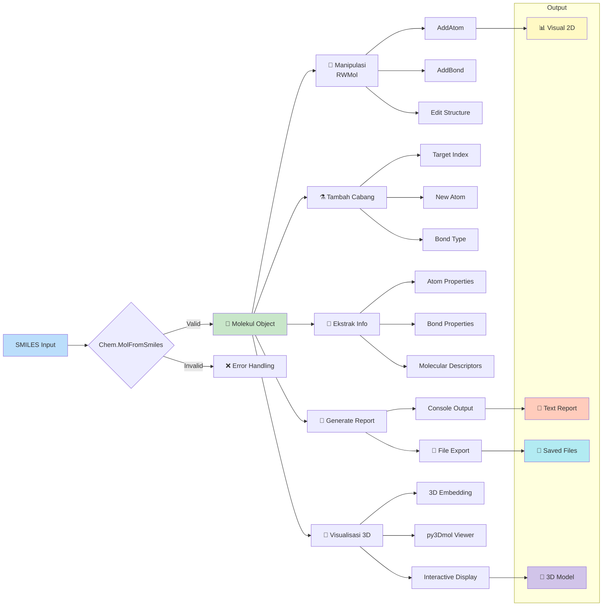
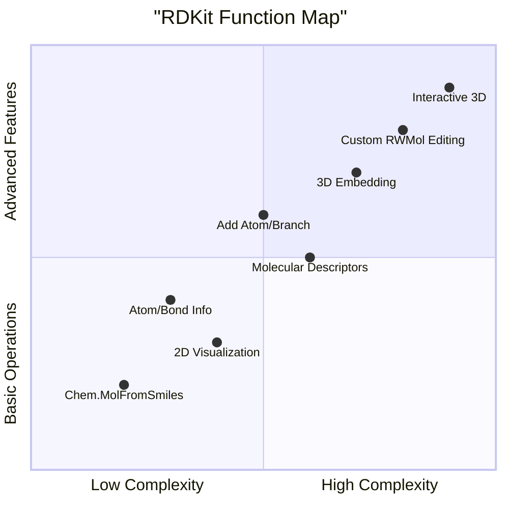

[[RDKit1]]

```mermaid
flowchart LR
    A[SMILES Input] --> B{Chem.MolFromSmiles}
    B -->|Valid| C[🧬 Molekul Object]
    B -->|Invalid| D[❌ Error Handling]
    
    C --> E[📘 Manipulasi<br>RWMol]
    C --> F[⚗️ Tambah Cabang]
    C --> G[🧬 Ekstrak Info]
    C --> H[🧾 Generate Report]
    C --> I[🧠 Visualisasi 3D]
    
    E --> E1[AddAtom]
    E --> E2[AddBond]
    E --> E3[Edit Structure]
    
    F --> F1[Target Index]
    F --> F2[New Atom]
    F --> F3[Bond Type]
    
    G --> G1[Atom Properties]
    G --> G2[Bond Properties]
    G --> G3[Molecular Descriptors]
    
    H --> H1[Console Output]
    H --> H2[💾 File Export]
    
    I --> I1[3D Embedding]
    I --> I2[py3Dmol Viewer]
    I --> I3[Interactive Display]
    
    subgraph Output
        J[📊 Visual 2D]
        K[📝 Text Report]
        L[🎯 3D Model]
        M[💾 Saved Files]
    end
    
    E1 --> J
    H1 --> K
    H2 --> M
    I3 --> L
    
    style A fill:#bbdefb
    style C fill:#c8e6c9
    style J fill:#fff9c4
    style K fill:#ffccbc
    style L fill:#d1c4e9
    style M fill:#b2ebf2
```

___

## 🗂️ Quick Reference Table

```mermaid
quadrantChart
    title "RDKit Function Map"
    x-axis "Low Complexity" --> "High Complexity"
    y-axis "Basic Operations" --> "Advanced Features"
    
    "Chem.MolFromSmiles": [0.2, 0.2]
    "Atom/Bond Info": [0.3, 0.4]
    "2D Visualization": [0.4, 0.3]
    "Add Atom/Branch": [0.5, 0.6]
    "Molecular Descriptors": [0.6, 0.5]
    "3D Embedding": [0.7, 0.7]
    "Custom RWMol Editing": [0.8, 0.8]
    "Interactive 3D": [0.9, 0.9]
```

___
